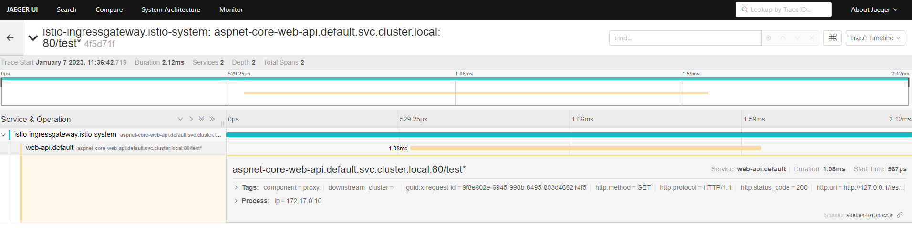

# Kubernetes ASP.NET Core WebApi Istio Helm Steeltoe Minikube example

### Build with: 

- ASP.NET Core Web API
- Docker
- Helm
- Istio
- Minikube
- Steeltoe

<details>
<summary>
Prerequisites
</summary>


```console
> choco install docker-desktop
```
```console
> choco install minikube
```
```console
> choco install kubernetes-cli
```
```console
> choco install kubernetes-helm
```

</details>


## Start:

```console
> ./start.ps1
```

### or 

```powershell 
#start minikube cluster
minikube start
#install istio demo profile
istioctl install --set profile=demo -y
#enable auto injecting sidecar into pods (default namespace)
kubectl label namespace default istio-injection=enabled --overwrite
#install kiali, prometheus, jaeger 
kubectl apply -f https://raw.githubusercontent.com/istio/istio/release-1.16/samples/addons/kiali.yaml
kubectl apply -f https://raw.githubusercontent.com/istio/istio/release-1.16/samples/addons/prometheus.yaml
kubectl apply -f https://raw.githubusercontent.com/istio/istio/release-1.16/samples/addons/jaeger.yaml

#provide terminal to docker engine inside minikube
minikube -p minikube docker-env --shell powershell | Invoke-Expression

#build aspnet-core-web-api docker image inside minikube
docker build -t aspnet-core-web-api:latest .\src\WebApi

#update helm dependencies
helm dependency update .\k8s

#install helm package
helm install web-api .\k8s --wait

#enable access to application running within minikube (istio-ingressgateway)
minikube tunnel
```
<pre>
Browse to<a href="http://127.0.0.1/test"> http://127.0.0.1/test</a>
</pre>

## Dashboards
```console 
minikube dashboard
```

```console 
istioctl dashboard kiali
```


```console 
istioctl dashboard jaeger
```



## Cleanup

```powershell

#uninstall helm web-api package
helm uninstall web-api
#remove istio
istioctl uninstall --purge

```